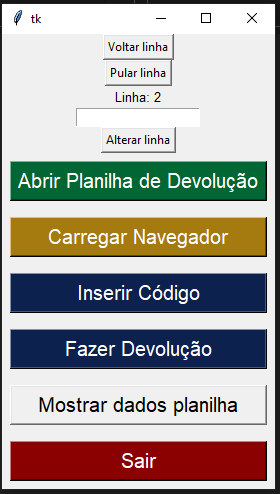

<h3>Sistema automático de devolução de produtos usando planilhas usado no Broker DFA.</h3> 
Este sistema foi desenvolvido para auxiliar na devolução de produtos de empresas que usam o <strong>WMS Control</strong> da Empresa LinkedBy.

Tutorial de como baixar este programa, independente do seu sistema operacional:
<ol>
   
  <li>Clique no botão verde <strong>Code</strong></li> 
    
  <li>Clique no botão <strong>Download ZIP</strong></li> 
    
</ol>

<h1>Devolução automática</h1>
<h2>Windows</h2>

Se você estiver usando windows na máquina que irá fazer a devolução, siga os passos:

<ol>
  <li>Faça o download deste projeto na sua máquina</li>
  <li>Descompacte e abra a pasta</li>
  <li>Abra a pasta <strong>source</strong> e depois <strong>dist</strong></li>
  <li>Em seguida clique no arquivo executável dentro desta pasta</li>
</ol>

<h2>Linux</h2>

Se você estiver usando linux, siga estes passos: 

<ol>
  <li>Faça o download deste projeto na sua máquina</li>
  <li>Descompacte e abra a pasta</li>
  <li>Entre na pasta <strong>source</strong> e em seguida na pasta <strong>stable</strong></li>
  <li>Clique com o botão direito do mouse em um espaço em branco da tela</li>
  <li>Em seguida clique na opção <strong>abrir terminal aqui</strong></li>
  <li>Digite no terminal que abriu o seguinte: <strong>python3 app4_tela.py</strong></li>
</ol>
<b>Atenção!</b>
<ul>
  <li>No item 5 o nome da opção no linux pode ser diferente dependendo do seu sistema operacional (distribuição linux)</li>
</ul>

<h1>Como Usar: </h1>

Antes de usá-lo entenda que:

<ul>
  <li>Você deverá ter o Google Chrome instalado na sua máquina</li>
  <li>Você deverá ter uma planilha onde estarão os produtos a serem devolvidos com a extensão <b>.xlsx</b></li>
  <li>O programa abre o WMS no navegador, mas você usa as funcionalidades através da interface gráfica</li>
  <li>Nada te impede de manipular o navegador com o mouse, mas só faça isto se necessário</li>
  <li>Uma tela de terminal é aberta sempre que você iniciar o programa, servirá de ajuda para casos de erros</li>
</ul>

O programa apresenta a seguinte interface gráfica: 

  </img> 
Botões Principais:
<ol>
  <li><b>Abrir Planilha de Devolução</b> - abre a planilha com os produtos a serem devolvidos</li>
  <li><b>Carregar Navegador</b> - será aberta uma tela do Navegador Chrome onde você deverá inserir suas credenciais </li>
  <li><b>Inserir Código</b> - serve para inserir o código do produto a ser devolvido de acordo com a linha</li>
  <li><b>Fazer Devolução</b> - serve para escolher as opções devolução e picking, o lote a ser escolhido e suas posições</li>
  <li><b>Mostrar dados planilha</b> - mostra em uma tela os dados e linhas dos produtos carregados já prontos para serem devolvidos</li>
  <li><b>Sair</b> - Encerra o programa</li>
</ol>
Botões Auxiliares:
<ol>
  <li><b>Voltar Linha</b> - volta para a linha anterior de produto</li>
  <li><b>Pular linha</b> - avança para a proxima linha de produto</li>
  <li><b>"Caixa para escrever"</b> - nesta caixa você pode digitar uma linha específica que queira ir</li>
  <li><b>Alterar linha</b> - confirma e direciona para a linha digitada na caixa para escrever</li>
</ol>

<h1>Modelo de Planilha de produtos</h1>

Existe um padrão de planilha para que o programa funcione corretamente. Você pode encontrar modelos de planilhas na pasta <b>arquivos_de_apoio</b>.

A planilha deverá ter as colunas e na seguinte ordem:

<ol>
  <li>Código do Produto</li>
  <li>Nome do produto</li>
  <li>Quantidade do produto</li>
  <li>Validade do produto</li>
  <li>Coluna para diferenças nos produtos (avarias, faltas)</li>
  <li>Quantidade definitiva a ser devolvida no sistema</li>
</ol>
<b>Obs:</b>
<ul> 
  <li>Os produtos devem começar a serem inseriridos a partir da linha 2 do Excel;</li>
  <li>A coluna 3 não é a quantidade que será devolvida no sistema, mas sim a coluna 6; </li>
  <li>Se nos produtos não tiverem diferenças, você pode deixar a coluna 5 vazia (mas ela deve existir); </li>
  <li>A coluna 6 apresenta as quantidades que serão devolvidas no WMS.</li>
</ul>

Veja um exemplo de planilha: 

</img>