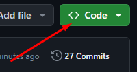
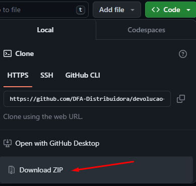

Sistema automático de devolução de produtos usando planilhas usado no Broker DFA. 
Este sistema foi desenvolvido para auxiliar na devolução de produtos de empresas que usam o <strong>WMS Control</strong> da Empresa LinkedBy.

Tutorial de como baixar este programa, independente do seu sistema operacional:
<ol>
   
  <li>Clique no botão verde <strong>Code</strong></li> 
    
  <li>Clique no botão <strong>Download ZIP</strong></li> 
    
</ol>

<h1>Devolução automática</h1>
<h2>Windows</h2>

Se você estiver usando windows na máquina que irá fazer a devolução, siga os passos:

<ol>
  <li>Faça o download deste projeto na sua máquina</li>
  <li>Descompacte e abra a pasta</li>
  <li>Abra a pasta <strong>source</strong> e depois <strong>dist</strong></li>
  <li>Em seguida clique no arquivo executável dentro desta pasta</li>
</ol>

<h2>Linux</h2>

Se você estiver usando linux, siga estes passos: 

<ol>
  <li>Faça o download deste projeto na sua máquina</li>
  <li>Descompacte e abra a pasta</li>
  <li>Entre na pasta <strong>source</strong> e em seguida na pasta <strong>stable</strong></li>
  <li>Clique com o botão direito do mouse em um espaço em branco da tela</li>
  <li>Em seguida clique na opção <strong>abrir terminal aqui</strong></li>
  <li>Digite no terminal que abriu o seguinte: <strong>python3 app4_tela.py</strong></li>
</ol>

Atenção! No item 5 o nome da opção no linux pode ser diferente dependendo do seu sistema operacional (distribuição linux)

<h1>Como Usar: </h1>

Antes de usá-lo entenda que:

<ul>
  <li>Você deverá ter uma planilha onde estarão os produtos a serem devolvidos</li>
  <li>O programa abre o WMS no navegador, mas você usa as funcionalidades através da interface gráfica</li>
  <li>Nada te impede de manipular o navegador com o mouse, mas só faça isto se necessário</li>
  <li>Uma tela de terminal é aberta sempre que você iniciar o programa, servirá de ajuda para casos de erros</li>
</ul>

O programa apresenta a seguinte interface gráfica: 

</img>
<ol>
  
</ol>
